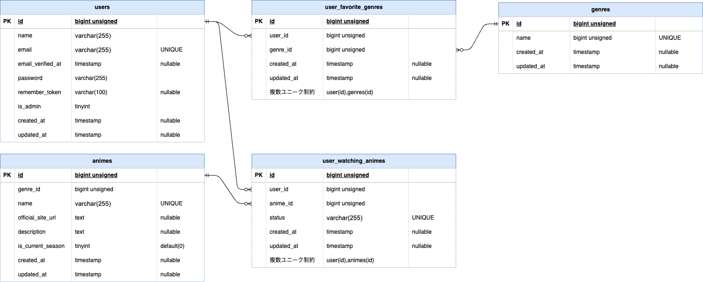

# AniShelf

## 概要

AniShelfはアニメの視聴状態を管理するアプリです 
「視聴予定」「視聴中」「視聴済み」の３種類の状態で管理することができます。 
また、**一般ユーザーと管理ユーザーの区分をしております。** 
管理者ユーザーのみ、アニメとジャンルの登録・編集・削除をすることができます。

## 実装した機能

### 一般・管理ユーザー共通

### 一般ユーザー

- ユーザー登録・ログイン・ログアウト
- アニメ一覧表示・詳細表示
- アニメ名によるキーワード検索
- ジャンルによる書籍の絞り込み
- アニメの視聴状態の登録

### 管理ユーザー

- アニメの視聴状態の登録
- アニメの登録・編集・削除
- ジャンル一覧画面の表示
- ジャンルの登録・編集・削除

## 使用技術

### バックエンド

- PHP 8.5.9
- Laravel 13.24.0
- Laravel Fortify
- MySQL 8.4

### フロントエンド

- React 19.2.0
- TypeScript 5.7.2
- Chakra UI 3.36.1
- Inertia.js 3
- Vite

### その他

- Docker

## ER図

## URL

https://anishelf.berogomacity.com/

### ログイン用ユーザー情報

- 管理ユーザー
    - メールアドレス : admin@example.com
    - パスワード： Admin*password1
- 一般ユーザー
    - メールアドレス : general@example.com
    - パスワード： General*password1

| ページ       | URL                                        |
| ------------ | ------------------------------------------ |
| ログイン     | https://anishelf.berogomacity.com/login    |
| ユーザー登録 | https://anishelf.berogomacity.com/register |
| アニメ一覧   | https://anishelf.berogomacity.com/         |
